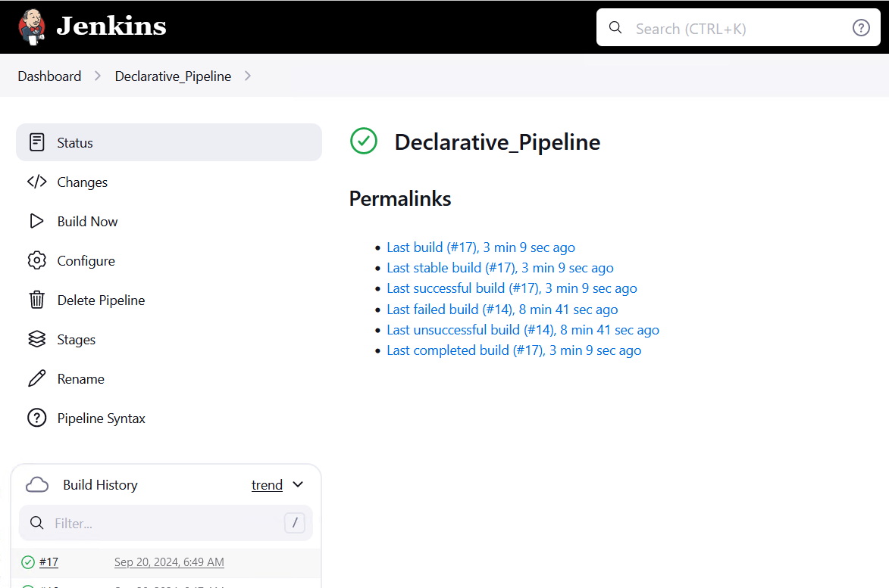

# Домашнее задание к занятию 10 «Jenkins» - Михалёв Сергей
-----
## Подготовка к выполнению

1. Создать два VM: для jenkins-master и jenkins-agent.
2. Установить Jenkins при помощи playbook.
3. Запустить и проверить работоспособность.
4. Сделать первоначальную настройку.

**Решение**
Создал две ВМ чеорез Vagrant с фиксированными IP. Создал [`ansible.cfg`](infrastructure/ansible.cfg). Внёс информацию в [`inventory`](infrastructure/inventory/cicd/hosts.yml) 
Установиk Jenkins при помощи playbook `ansible-playbook site.yml` 
 
Подключил `ansible agent` и отключил выполнение сборок на `master node`. Создал на ВМ `ansible agent` swap файл на 1Gb. 
 

-----

## Основная часть

1. Сделать Freestyle Job, который будет запускать `molecule test` из любого вашего репозитория с ролью.
2. Сделать Declarative Pipeline Job, который будет запускать `molecule test` из любого вашего репозитория с ролью.
3. Перенести Declarative Pipeline в репозиторий в файл `Jenkinsfile`.
4. Создать Multibranch Pipeline на запуск `Jenkinsfile` из репозитория.
5. Создать Scripted Pipeline, наполнить его скриптом из [pipeline](./pipeline).
6. Внести необходимые изменения, чтобы Pipeline запускал `ansible-playbook` без флагов `--check --diff`, если не установлен параметр при запуске джобы (prod_run = True). По умолчанию параметр имеет значение False и запускает прогон с флагами `--check --diff`.
7. Проверить работоспособность, исправить ошибки, исправленный Pipeline вложить в репозиторий в файл `ScriptedJenkinsfile`.
8. Отправить ссылку на репозиторий с ролью и Declarative Pipeline и Scripted Pipeline.
9. Сопроводите процесс настройки скриншотами для каждого пункта задания!!

### Решение

1. Сделал Freestyle Job, который будет запускать `molecule test` из репозитория с ролью. 
    
   Результат тестирования роли [`clickhouse`](https://github.com/sergeMMikh/role-clickhouse) в выводе консоли. 
    
    
2. Сделаk Declarative Pipeline Job, который будет запускать `molecule test` из репозитория с ролью. 
    
   Так как данный Pipeline связан с репозиторием на GitHub, в списке шагов добавился `Checkout SCM`. 
    
   После установки [устаревшего](https://wiki.jenkins.io/JENKINS/Pipeline-Stage-View-Plugin.html) плагина [`Pipeline: Stage View`](https://plugins.jenkins.io/pipeline-stage-view/)стало нагляднее. 
    
   Результат тестирования роли [`clickhouse`](https://github.com/sergeMMikh/role-clickhouse) в выводе консоли. 
    
3. Перенёс Declarative Pipeline в репозиторий в файл [`Jenkinsfile`](https://github.com/sergeMMikh/role-clickhouse/blob/master/Jenkinsfile).
4. Создал Multibranch Pipeline на запуск `Jenkinsfile` из репозитория. 
    
5. Создал Scripted Pipeline, наполнить его скриптом из требуемого репозитория. 
    
6. Внёс необходимые изменения, чтобы Pipeline запускал `ansible-playbook` без флагов `--check --diff`, если не установлен параметр при запуске джобы (prod_run = True). По умолчанию параметр имеет значение False и запускает прогон с флагами `--check --diff`. 
    
    
7. Проверить работоспособность, исправить ошибки, исправленный Pipeline вложить в репозиторий в файл [`ScriptedJenkinsfile`](ScriptedJenkinsfile).
8. Ссылку на [репозиторий с ролью](https://github.com/sergeMMikh/role-clickhouse) и [`Declarative Pipeline`](https://github.com/sergeMMikh/hw_jenkins_2/blob/main/Declarative%20Pipeline) и [`Scripted Pipeline`](https://github.com/sergeMMikh/hw_jenkins_2/blob/main/Scripted%20Pipeline).
---
